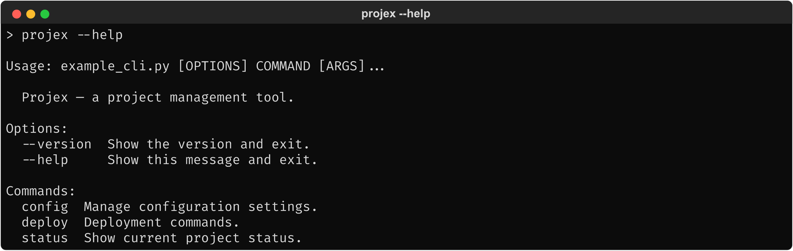
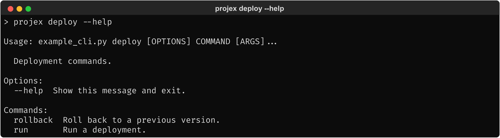
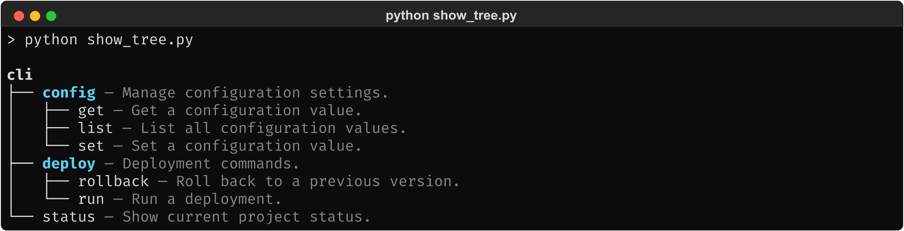

# 1.2.1. Status Quo: Core Packages

> Practical demonstration of Click and `rich` as they relate to `click-prism`.
> All examples use the same fictional CLI ("Projex") defined in
> `design/_examples/cli/example_cli.py`.

## 1.2.1.1. Click

### 1.2.1.1.1. Developer integration

A standard Click group with nested subgroups, options, arguments, and a hidden
command:

```python
@click.group()
@click.version_option("1.0.0")
def cli():
    """Projex — a project management tool."""

@cli.group()
def config():
    """Manage configuration settings."""

@config.command()
@click.argument("key")
def get(key):
    """Get a configuration value."""
    click.echo(f"{key}=example_value")

@cli.group()
def deploy():
    """Deployment commands."""

@deploy.command()
@click.option("--env", type=click.Choice(["staging", "production"]), required=True)
@click.option("--dry-run", is_flag=True, help="Simulate without making changes.")
def run(env, dry_run):
    """Run a deployment."""

@cli.command()
def status():
    """Show current project status."""

@cli.command(hidden=True)
def debug():
    """Show debug information."""
```

### 1.2.1.1.2. Output

**End user: `projex --help`**


<!-- Textual output: screenshots/click_help.txt -->

**End user: `projex deploy --help`**


<!-- Textual output: screenshots/click_help_deploy.txt -->

### 1.2.1.1.3. Observations

- Help output is flat: each level shows only its immediate children. There is no
  way to see the full command hierarchy at a glance.
- Hidden commands (`debug`) are excluded from help — expected behavior.
- The `Commands:` section is a simple two-column list (name + short help).
  `format_commands()` is the method that renders this section.

## 1.2.1.2. Rich — DIY tree rendering

The most common workaround for the lack of a tree plugin: a short script using
`rich.tree.Tree` to walk the Click hierarchy.

### 1.2.1.2.1. Developer integration

```python
from rich.console import Console
from rich.tree import Tree

def build_tree(group: click.Group, ctx: click.Context, tree: Tree | None = None) -> Tree:
    if tree is None:
        tree = Tree(f"[bold]{group.name}[/bold]")
    for name in group.list_commands(ctx):
        cmd = group.get_command(ctx, name)
        if cmd is None or cmd.hidden:
            continue
        help_text = cmd.get_short_help_str()
        if isinstance(cmd, click.Group):
            branch = tree.add(f"[bold cyan]{name}[/bold cyan] [dim]— {help_text}[/dim]")
            child_ctx = click.Context(cmd, info_name=name, parent=ctx)
            build_tree(cmd, child_ctx, branch)
        else:
            tree.add(f"{name} [dim]— {help_text}[/dim]")
    return tree

ctx = click.Context(cli, info_name="projex")
Console().print(build_tree(cli, ctx))
```

### 1.2.1.2.2. Output


<!-- Textual output: screenshots/rich_tree.txt -->

### 1.2.1.2.3. Observations

- ~20 lines of code produces a colored, recursive tree view — demonstrates both
  that the gap is real and that the building blocks exist.
- Uses Click's public API (`list_commands`, `get_command`,
  `isinstance(cmd, click.Group)`) — the standard traversal approach.
- Groups are bold cyan, help text is dim — `rich` markup makes styling trivial.
- Not integrated into the CLI itself: this is a standalone script, not a
  subcommand. A developer would need to wire this up manually (register a
  command, handle context creation, add CLI flags).
- No ASCII fallback, no depth limiting, no filtering, no configuration — all
  things that must be built from scratch each time.
