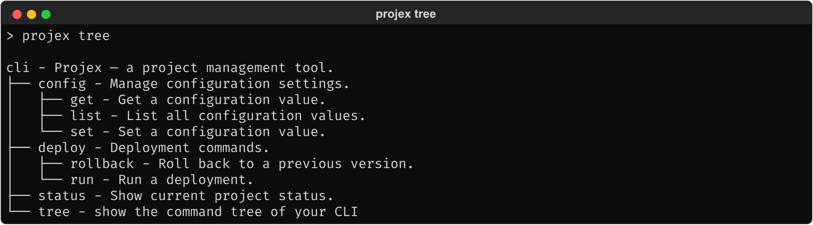

# 1.2.2. Status Quo: Competing Packages

> Practical demonstration of `click-command-tree` — the only existing Click
> tree-view plugin. Same Projex CLI used throughout.

## 1.2.2.1. click-command-tree

### 1.2.2.1.1. Developer integration

Requires `click-plugins` as a co-dependency. The integration pattern uses the
`@with_plugins()` decorator with entry-point discovery:

```python
import importlib.metadata

import click
from click_plugins import with_plugins

@with_plugins(importlib.metadata.entry_points(group="click_command_tree"))
@click.group()
@click.version_option("1.0.0")
def cli():
    """Projex — a project management tool."""
```

The `tree` subcommand is registered automatically via the
`click_command_tree` entry-point group — no explicit `add_command()` or
`cls=` needed, but also no way to avoid the `click-plugins` dependency or
customize the command name.

### 1.2.2.1.2. Output

**End user: `projex tree`**


<!-- Textual output: screenshots/click_command_tree.txt -->

### 1.2.2.1.3. Observations

- Produces a correct recursive tree with Unicode box-drawing characters.
- Includes itself (`tree`) in the output — it's a regular subcommand.
- Root node shows the group name + full help text (`cli - Projex — ...`).
- Plain text only — no color, no styling, no `rich` support.
- No `--depth`, no `--show-hidden`, no `--json`, no filtering of any kind.
- Help separator is ` - ` (hyphen), not configurable.
- The `@with_plugins()` pattern is more invasive than `cls=` — it wraps the
  group decorator and requires understanding the entry-point mechanism. Compare
  with how `rich-click`, `click-didyoumean`, and `cloup` integrate via a single `cls=`
  argument.
- Depends on `click-plugins`, which is effectively abandoned (maintainers
  recommend vendoring rather than installing).
