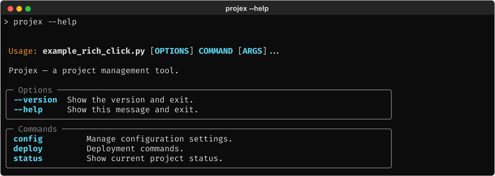
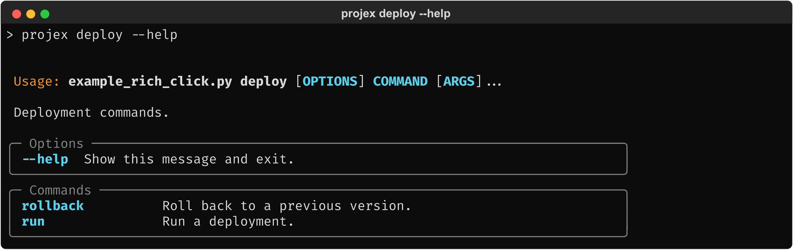
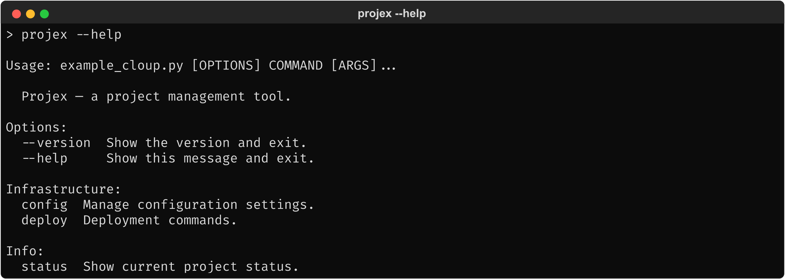
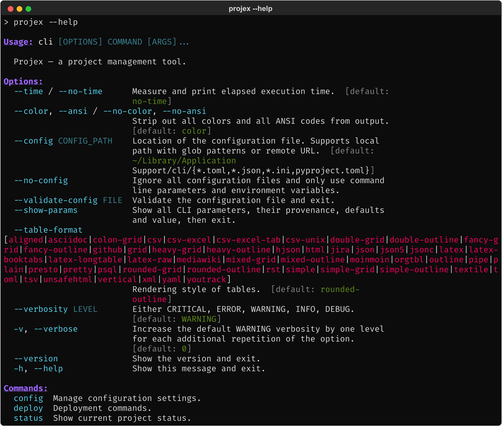
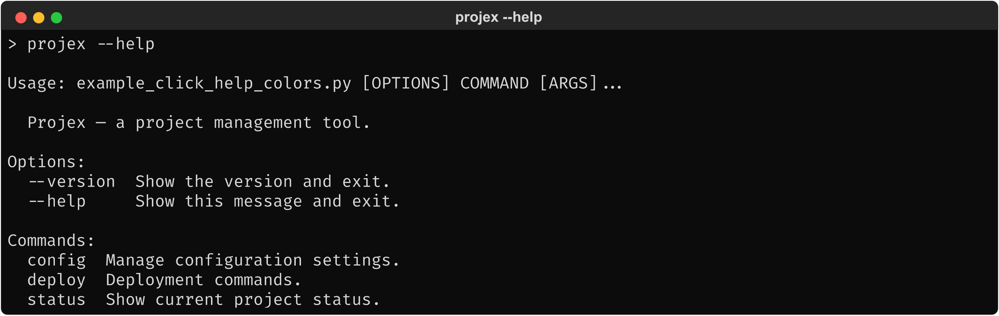
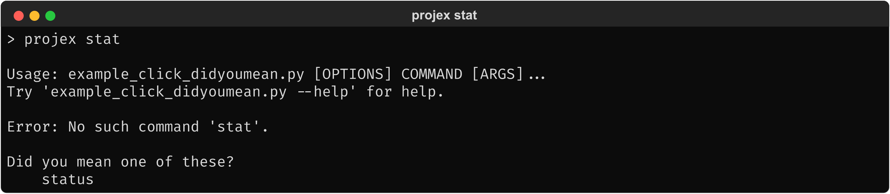
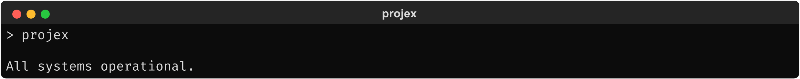
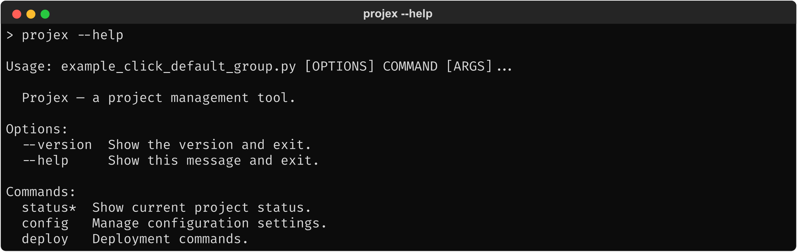
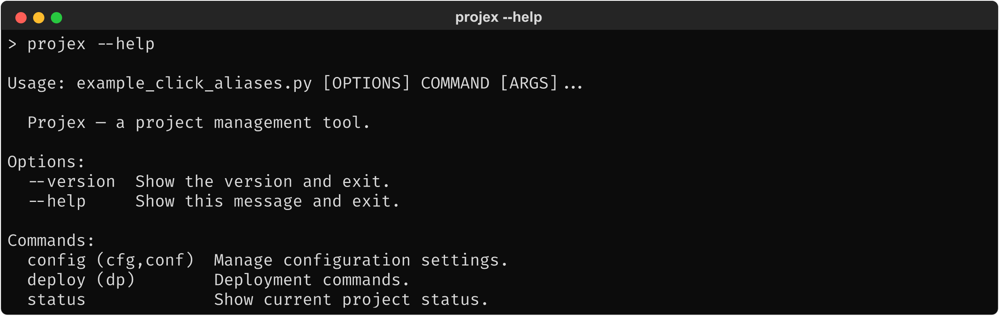

# 1.2.3. Status Quo: Related Packages

> Practical demonstration of the packages identified in section 1.1.4 as relevant
> neighbors. Each section shows the developer integration pattern, output, and
> internal details (which Click methods are overridden). Same Projex CLI used
> throughout.

## 1.2.3.1. rich-click

### 1.2.3.1.1. Developer integration

Two integration approaches; the `cls=` pattern is shown here:

```python
import click
from rich_click import RichGroup

@click.group(cls=RichGroup)
@click.version_option("1.0.0")
def cli():
    """Projex — a project management tool."""
```

Child groups automatically inherit `RichGroup` via `group_class`.

### 1.2.3.1.2. Output

**End user: `projex --help`**


<!-- Textual output: screenshots/rich_click_help.txt -->

**End user: `projex deploy --help`**


<!-- Textual output: screenshots/rich_click_help_deploy.txt -->

### 1.2.3.1.3. Internals

- Integrates via `cls=RichGroup` — the standard Click `cls=` pattern.
- `RichGroup` overrides `format_help()` with its own `rich`-based rendering
  pipeline. `format_commands()` is stubbed out (no-op) — commands are rendered
  through a different code path inside `format_help()`.
- Has configurable styles/themes via `RichHelpConfiguration`.
- Child groups inherit `RichGroup` automatically via `group_class`.
- The most popular Click help extension by adoption (see section 1.1.3).

## 1.2.3.2. Cloup

### 1.2.3.2.1. Developer integration

```python
import click
import cloup
from cloup import Section

INFRA_SECTION = Section("Infrastructure")
INFO_SECTION = Section("Info")

@cloup.group(sections=[INFRA_SECTION, INFO_SECTION])
@click.version_option("1.0.0")
def cli():
    """Projex — a project management tool."""

@cli.group(section=INFRA_SECTION)
def config(): ...

@cli.group(section=INFRA_SECTION)
def deploy(): ...

@cli.command(section=INFO_SECTION)
def status(): ...
```

`cloup`'s `@cloup.group()` is a drop-in replacement for `@click.group()`. Its main
feature is subcommand sections — labeled groupings of a group's immediate
children, configured by defining `Section` objects and assigning commands to them.

### 1.2.3.2.2. Output

**End user: `projex --help`**


<!-- Textual output: screenshots/cloup_help.txt -->

### 1.2.3.2.3. Internals

- Sections replace the flat `Commands:` heading with labeled groups
  (`Infrastructure:`, `Info:`). The commands themselves are unchanged.
- `cloup`'s `Group` preserves `list_commands()` / `get_command()` unchanged.
  Sections are rendered by an overridden `format_commands()`.
- Also supports command aliases (separate from `click-aliases`).
- `click-extra` builds on `cloup`'s `Group`, so the same internal structure
  applies to `click-extra`.

## 1.2.3.3. click-extra

### 1.2.3.3.1. Developer integration

`click-extra` provides `extra_group()` as a drop-in replacement for
`@click.group()`. It automatically injects additional flags (`--config`,
`--color`/`--no-color`, `--show-params`, `--time-execution`, etc.):

```python
from click_extra import group

@group()
def cli():
    """Projex — a project management tool."""
```

No `@click.version_option` is needed — `--version` is included automatically.
Child groups can use `@cli.group()` as normal; they inherit the `ExtraGroup`
behavior via `group_class`.

### 1.2.3.3.2. Output

**End user: `projex --help`**


<!-- Textual output: screenshots/click_extra_help.txt -->

### 1.2.3.3.3. Internals

- `ExtraGroup` inherits from `cloup.Group` plus several mixins. All of `cloup`'s
  behavior (sections, aliases, custom formatter) applies.
- The injected flags (`--config`, `--color`, `--show-params`, etc.) are added as
  eager options at the group level — they do not appear on subcommands.
- `--show-params` introspects the CLI parameter tree at runtime — closest
  existing feature to tree visualization, but output is a table of parameters,
  not a command hierarchy.
- GPL-2.0-or-later license — a potential adoption blocker for users in
  permissively-licensed projects (see section 1.1.3).
- Builds on `cloup`, so `list_commands()` / `get_command()` are unchanged.
  `format_commands()` uses `cloup`'s sectioned rendering.

## 1.2.3.4. click-help-colors

### 1.2.3.4.1. Developer integration

```python
import click
from click_help_colors import HelpColorsGroup

@click.group(
    cls=HelpColorsGroup,
    help_headers_color="yellow",
    help_options_color="green",
)
@click.version_option("1.0.0")
def cli():
    """Projex — a project management tool."""
```

Colors are configured as keyword arguments on the group decorator.

### 1.2.3.4.2. Output

**End user: `projex --help`**


<!-- Textual output: screenshots/click_help_colors_help.txt -->

### 1.2.3.4.3. Internals

- Integrates via `cls=HelpColorsGroup`.
- Colorization works by overriding `get_help()` to swap in a
  `HelpColorsFormatter` that injects ANSI codes at the formatter level
  (`write_usage()`, `write_heading()`, `write_dl()`). Click's standard
  `format_help()` pipeline runs unchanged. Does not override `list_commands()`
  or `get_command()`.
- Classified as discontinued by Snyk (last release November 2023), but still
  widely downloaded.

## 1.2.3.5. click-didyoumean

### 1.2.3.5.1. Developer integration

```python
import click
from click_didyoumean import DYMGroup

@click.group(cls=DYMGroup)
@click.version_option("1.0.0")
def cli():
    """Projex — a project management tool."""
```

### 1.2.3.5.2. Output

**End user: `projex stat`**


<!-- Textual output: screenshots/click_didyoumean_err.txt -->

### 1.2.3.5.3. Internals

- Integrates via `cls=DYMGroup`.
- Overrides `resolve_command()` only — does not touch `list_commands()`,
  `get_command()`, or `format_commands()`.
- Very widely adopted (see section 1.1.3 for download figures).

## 1.2.3.6. click-default-group

### 1.2.3.6.1. Developer integration

```python
import click
from click_default_group import DefaultGroup

@click.group(cls=DefaultGroup, default="status", default_if_no_args=True)
@click.version_option("1.0.0")
def cli():
    """Projex — a project management tool."""
```

### 1.2.3.6.2. Output

**End user: `projex`**


<!-- Textual output: screenshots/click_default_group_noarg.txt -->

**End user: `projex --help`**


<!-- Textual output: screenshots/click_default_group_help.txt -->

### 1.2.3.6.3. Internals

- Integrates via `cls=DefaultGroup`.
- The default command appears with `*` suffix in help output. This comes from
  an overridden `format_commands()` that modifies the display name.
- Overrides `parse_args()`, `get_command()`, `resolve_command()`, and
  `command()` to implement default dispatch. `list_commands()` is unchanged.
- Widely adopted (see section 1.1.3 for download figures).

## 1.2.3.7. click-aliases

### 1.2.3.7.1. Developer integration

```python
import click
from click_aliases import ClickAliasedGroup

@click.group(cls=ClickAliasedGroup)
@click.version_option("1.0.0")
def cli():
    """Projex — a project management tool."""

@cli.group(aliases=["cfg", "conf"])
def config():
    """Manage configuration settings."""

@cli.group(aliases=["dp"])
def deploy():
    """Deployment commands."""
```

Aliases are passed as a list to each command/group decorator.

### 1.2.3.7.2. Output

**End user: `projex --help`**


<!-- Textual output: screenshots/click_aliases_help.txt -->

### 1.2.3.7.3. Internals

- Integrates via `cls=ClickAliasedGroup`.
- Aliases appear in parentheses after the command name in help output. This
  formatting comes from an overridden `format_commands()`.
- `get_command()` is overridden to resolve aliases to their target commands.
  `list_commands()` returns canonical names only (no alias entries).
- Moderately adopted (see section 1.1.3 for download figures).
