# 2.3.1. UX: Plain Click

All scenarios use the Projex CLI from section 1.2.1 as the starting point: a
plain Click application with nested groups, options, arguments, and a
hidden command. No `rich`, no third-party extensions — just Click and
`click-prism`.

Each scenario shows developer code and the resulting end-user
experience. Code examples illustrate the desired API; specific names
and signatures may evolve during design.

## 2.3.1.1. Integration paths

Three ways to add tree visualization, ordered from most conventional
to most lightweight.

### 2.3.1.1.1. Group subclass

The standard `click` ecosystem pattern for extending group behavior
(same `cls=` pattern used by `rich-click`, `click-didyoumean`,
`cloup` — see section 1.2.3):

```python
import click
from click_prism import PrismGroup

@click.group(cls=PrismGroup)
@click.version_option("1.0.0")
def cli():
    """Projex — a project management tool."""

# ... commands defined as before (no changes) ...
```

One decorator change. The rest of the CLI is unchanged. This single
change on the root group enables:

- **Tree-as-help**: the tree replaces Click's flat command list in
  the root group's `--help` output; subgroups retain Click's standard
  format (section 2.3.1.4).
- **`--help-json`**: machine-readable CLI discovery on the root group
  (section 2.3.1.5).
- **Child group inheritance**: groups created via `@cli.group()`
  automatically inherit tree behavior — a single `cls=PrismGroup` on
  the root covers the whole CLI.

**End user: `projex --help`**

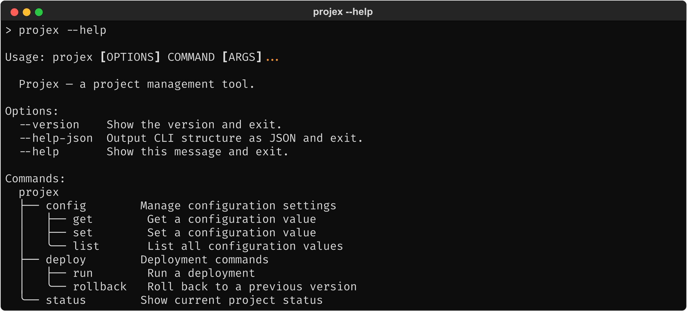
<!-- Textual output: mocks/mock_help_tree.txt -->

No tree subcommand is created. To add one with runtime controls like
`--depth`, see section 2.3.1.1.2.

### 2.3.1.1.2. Tree subcommand (opt-in)

For developers who want end users to have runtime controls
(`--depth`), the tree subcommand is explicitly added:

```python
cli.add_command(tree_command())
```

**End user: `projex tree`**


<!-- Textual output: mocks/mock_tree_plain.txt -->

The tree subcommand shows the full command hierarchy with help text.
Hidden commands (like `debug`) are excluded by default.

This works with or without `PrismGroup`. Combined with the group
subclass path, the CLI offers both tree-as-help and a tree subcommand
with runtime controls. Without `PrismGroup`, it adds only the tree
subcommand — no help changes, no `--help-json`.

### 2.3.1.1.3. Standalone functions

For debugging, testing, documentation generation, or scripting — no
CLI modification at all:

```python
from click_prism import show_tree

show_tree(cli)
```

Output:

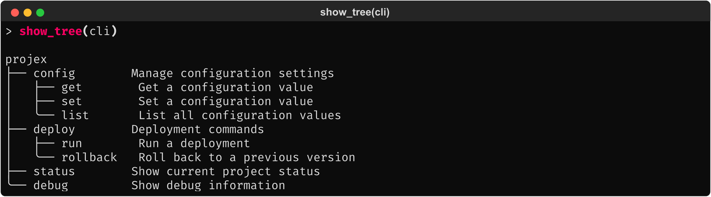
<!-- Textual output: mocks/mock_show_tree.txt -->

`show_tree()` is a Python function, not a CLI command. It prints the
tree to stdout without modifying the CLI or requiring a `click` context.
Since there is no end-user context, hidden commands are included — the
developer inspecting the CLI structure wants to see everything.

`render_tree(cli)` is the sibling entry point that returns the
rendered tree as a `str` instead of printing it — for capturing
output in tests, embedding in generated docs, or piping through a
post-processor. Same defaults as `show_tree()`; `show_tree()` is
literally `click.echo(render_tree(cli))`.

## 2.3.1.2. Runtime controls

When `tree_command()` is added (section 2.3.1.1.2), the tree subcommand accepts
runtime flags:

**End user: `projex tree --help`**

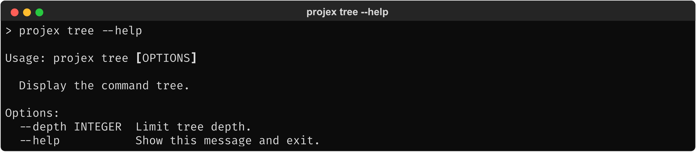
<!-- Textual output: mocks/mock_tree_subcommand_help.txt -->

**End user: `projex tree --depth 1`**

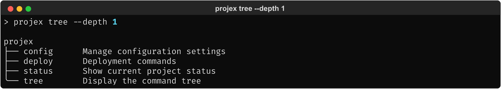
<!-- Textual output: mocks/mock_tree_depth1.txt -->

`--depth` limits how deep the tree renders. Groups whose children are
hidden by the depth limit still appear — the end user sees that a
group exists but not its contents.

The runtime flag overrides any developer-configured depth default
(section 2.3.1.3.2).

## 2.3.1.3. Configuration

Developer-controlled settings that affect tree output. Configuration
is passed at definition time and applies to both tree-as-help and the
tree subcommand (when added).

### 2.3.1.3.1. Output style

**Unicode** (default) — rounded arc corners (`╰`) for the last
branch at each level, giving the tree a softer appearance:

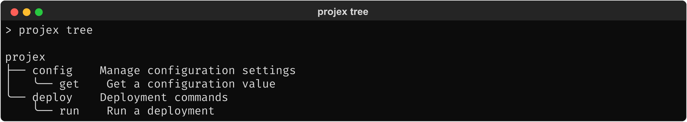
<!-- Textual output: mocks/mock_tree_unicode_style.txt -->

**ASCII** — for environments where Unicode box-drawing glyphs don't
render:

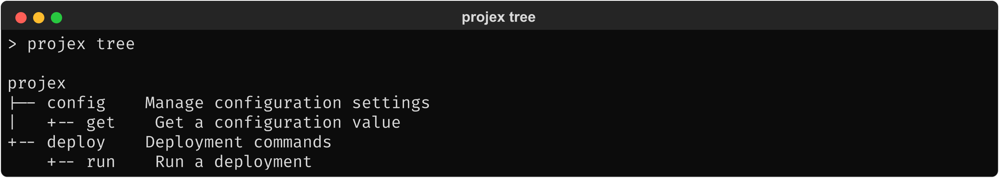
<!-- Textual output: mocks/mock_tree_ascii_style.txt -->

The developer chooses the style. If the terminal does not support the
chosen style's characters, output degrades gracefully (section 2.2.2).

### 2.3.1.3.2. Depth

A developer-configured depth limit sets the default for tree-as-help
and the tree subcommand. The end user's `--depth` flag on the tree
subcommand overrides it (section 2.3.1.2).

### 2.3.1.3.3. Hidden commands

By default, hidden commands are excluded from tree output (matching
Click's `--help` behavior). The developer can configure them to be
included:

```python
@click.group(cls=PrismGroup, tree_config=TreeConfig(show_hidden=True))
def cli():
    """Projex — a project management tool."""
```

**End user: `projex tree`**

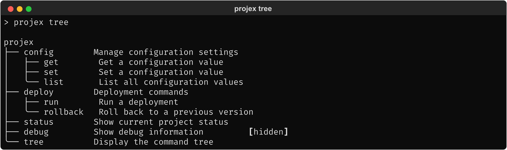
<!-- Textual output: mocks/mock_tree_show_hidden.txt -->

Hidden commands are visually marked so they are distinguishable from
regular commands. This is a developer-configured setting — there is
no end-user `--show-hidden` flag (section 2.3.4.0).

### 2.3.1.3.4. Deprecated commands

Deprecated commands are always included (matching Click's behavior)
with a visual marker:

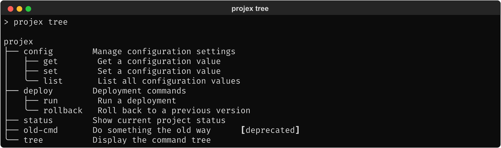
<!-- Textual output: mocks/mock_tree_deprecated.txt -->

### 2.3.1.3.5. Tree command name

The default subcommand name is `tree`. The developer can choose a
different name:

```python
cli.add_command(tree_command(name="commands"))
```

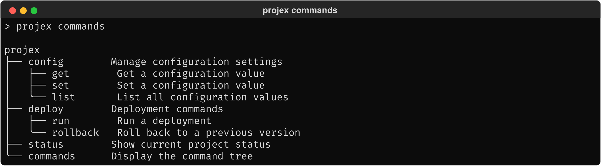
<!-- Textual output: mocks/mock_tree_renamed.txt -->

If the chosen name (or the default `tree`) collides with an existing
command on the same group, `click-prism` raises a clear error at
definition time rather than silently overwriting the existing command.

### 2.3.1.3.6. Per-group configuration

Different groups can have different tree settings:

```python
from click_prism import PrismGroup, TreeConfig

@click.group(cls=PrismGroup)
def cli():
    """Projex — a project management tool."""

@cli.group(tree_config=TreeConfig(depth=1))
def admin():
    """Admin tools (large subcommand tree)."""
```

Configuration set on a child group takes precedence over inherited
configuration. Fields not explicitly set on the child inherit from
the parent.

### 2.3.1.3.7. Parameter display

The developer can enable a 4-column layout that shows each command's
arguments and options alongside the tree:

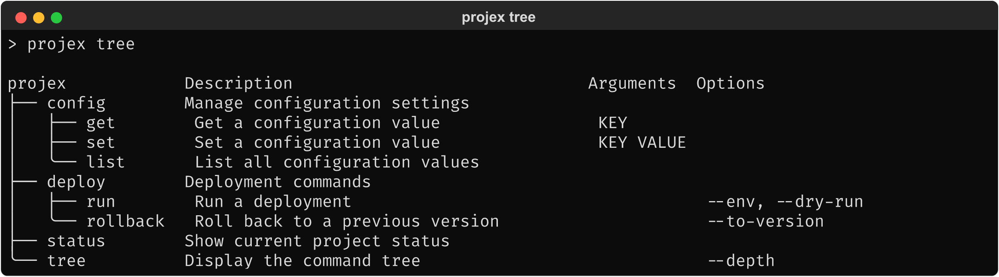
<!-- Textual output: mocks/mock_tree_show_params.txt -->

The root name (`projex`) acts as the column header for column 0;
`Description`, `Arguments`, and `Options` label the remaining
columns. Columns 1–3 use a subtle 1-character indent for nested
commands, echoing the tree hierarchy without full indentation.

- **Arguments**: shown in uppercase (e.g., `KEY`, `VALUE`), matching
  Click's convention for positional parameters.
- **Options**: long-form option name (e.g., `--env` rather than
  `-e/--env`), comma-separated when multiple. Options without a
  long form show the short form. Boolean flag pairs use
  `--[no-]flag` notation (e.g., `--[no-]verbose`).
- **Column positions are fixed**: the tree and description columns
  adapt to content width, but Arguments and Options are anchored to
  the header row so they scan vertically.

This is a developer-configured setting, not an end-user toggle — the
CLI author decides whether the parameter columns are useful for their
audience.

## 2.3.1.4. Tree-as-help

When using the group subclass path (section 2.3.1.1.1), `--help` can replace
Click's flat command list with a tree view. Three modes, set via
`tree_config` on the root group:

```python
# Root only (default) — no explicit setting needed:
@click.group(cls=PrismGroup)
def cli(): ...

# All groups:
@click.group(cls=PrismGroup, tree_config=TreeConfig(tree_help="all"))
def cli(): ...

# Disabled — tree-as-help off, but PrismGroup still provides --help-json:
@click.group(cls=PrismGroup, tree_config=TreeConfig(tree_help="none"))
def cli(): ...
```

### 2.3.1.4.1. Root only (default)

**End user: `projex --help`**


<!-- Textual output: mocks/mock_help_tree.txt -->

The tree replaces the command list in the root group's help.

**End user: `projex deploy --help`**

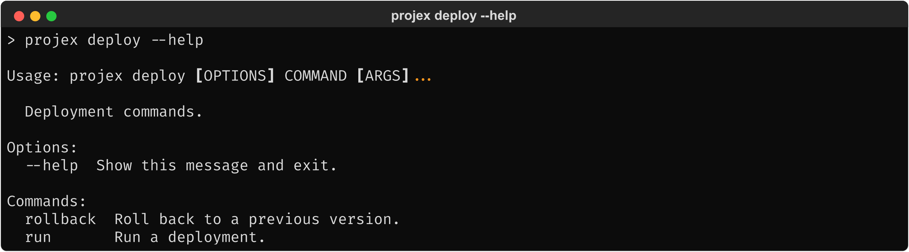
<!-- Textual output: mocks/mock_deploy_help_flat.txt -->

Subgroups keep Click's standard flat list. The root group is where an
overview of the full hierarchy is most useful; subgroups typically
have simpler structures where the flat list is sufficient.

### 2.3.1.4.2. All groups

The developer can enable tree-as-help on every group.

**End user: `projex deploy --help`**

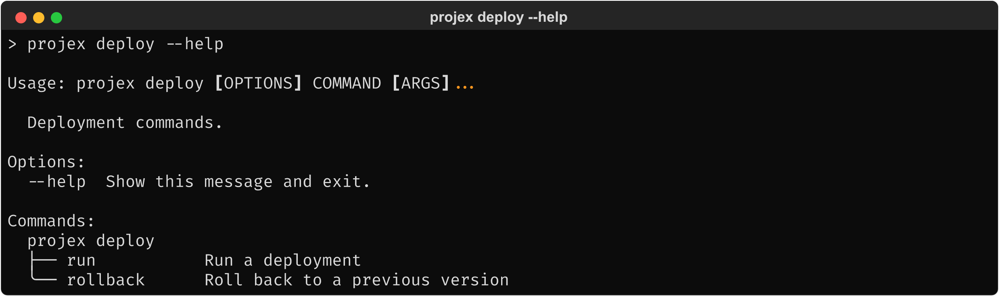
<!-- Textual output: mocks/mock_deploy_help_tree.txt -->

### 2.3.1.4.3. Disabled

The developer can disable tree-as-help entirely. `--help` output at
all levels is identical to standard Click. The tree is available only
through the tree subcommand (if added) or `show_tree()`.

### 2.3.1.4.4. Tree-as-help vs. tree subcommand

When the developer adds `tree_command()` alongside `PrismGroup`, both
coexist:

- **`--help`** output uses the developer's configured settings. The
  end user cannot adjust depth or other settings — this is the
  curated help view.
- **`projex tree --depth N`** gives the end user runtime control.

The tree subcommand is not created automatically by `PrismGroup` — it
requires an explicit `add_command(tree_command())`.

## 2.3.1.5. Machine-readable output

The group subclass path (section 2.3.1.1.1) automatically adds a `--help-json`
eager option on the root group. It outputs the full CLI hierarchy as
structured JSON and exits:

**End user: `projex --help-json`**

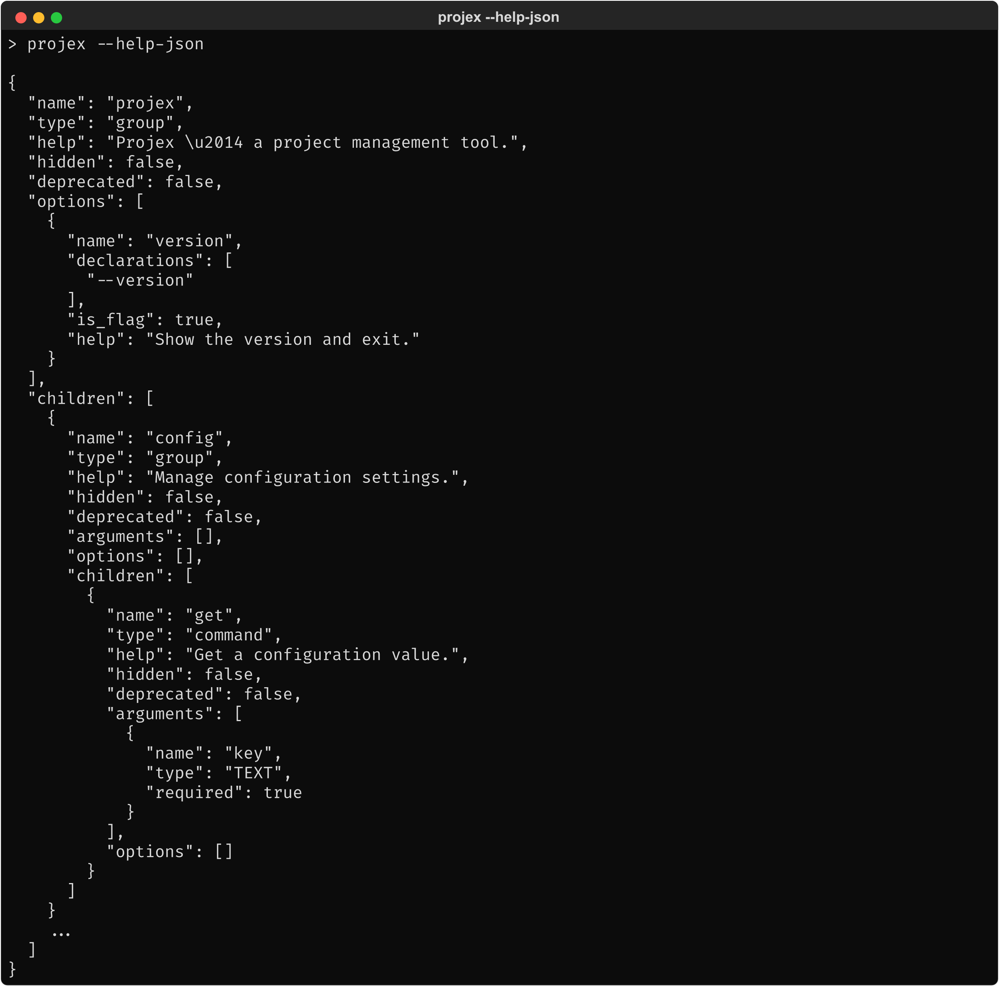
<!-- Textual output: mocks/mock_help_json.txt -->

Intended for tooling, coding agents, and automation that need to
discover a CLI's command surface through a single shell command —
without knowing anything about the CLI's internals.

Desired behavior:

- **Root only.** `--help-json` is available on the root group only —
  the use case is full CLI discovery, not subtree inspection. The
  complete tree includes all subtrees; tools can filter client-side.
- **Full depth, always.** The output ignores any configured depth
  limit. The purpose is complete CLI discovery; partial output
  defeats the use case.
- **All metadata.** Includes all commands (including hidden and
  deprecated), all parameters (arguments and options with their
  types, defaults, flags, help text), regardless of other
  configuration settings.
- **Tree subcommand included.** If `tree_command()` has been added,
  it is included in the JSON like any other command — tooling and
  agents can identify it by name and decide whether to filter it
  client-side.
- **Replaces visual output.** When `--help-json` is passed, no help
  or tree visualization is shown. Output is valid JSON to stdout,
  suitable for piping to `jq`.

The same JSON structure is available as a Python function:

```python
from click_prism import show_tree

show_tree(cli, format="json")
```

This prints the JSON to stdout without requiring a CLI invocation or
Click context — intended for documentation generation, testing, and
scripting. The output follows the same rules: full depth, all
metadata.

`render_tree(cli, format="json")` is the string-returning sibling —
same JSON, but returned as a `str` instead of printed. Use it when
the caller wants to embed the JSON somewhere (a test assertion, a
generated doc, an in-memory `json.loads(...)`) rather than capture
stdout.

## 2.3.1.6. Edge cases

### 2.3.1.6.1. Lazy-loading groups

Some Click applications load subcommands on demand via custom
`list_commands()` / `get_command()` implementations. Tree rendering
works with lazy groups — it uses the same public Click API that Click
itself uses for help and dispatch.

### 2.3.1.6.2. Commands that fail to load

When `get_command()` raises an exception or returns `None` for a
command listed by `list_commands()`, the tree shows the command name
with an error indicator rather than crashing:

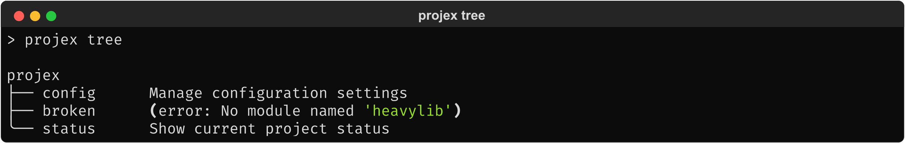
<!-- Textual output: mocks/mock_tree_errors.txt -->

The error message includes enough detail for the developer to
diagnose the issue.

### 2.3.1.6.3. Name collision

If the tree command name collides with an existing command on the
same group, `click-prism` raises a clear error at definition time
(section 2.3.1.3.5).

### 2.3.1.6.4. Large CLIs

CLIs with hundreds of commands produce long tree output. The tree
renders correctly regardless of size. Depth limiting (sections 2.3.1.2, 2.3.1.3.2) is the
management mechanism — `click-prism` does not paginate or truncate
automatically.

### 2.3.1.6.5. Subtree scoping

When `tree_command()` is added to a child group, the tree subcommand
on that group shows only that group's subtree:

**End user: `projex deploy tree`**

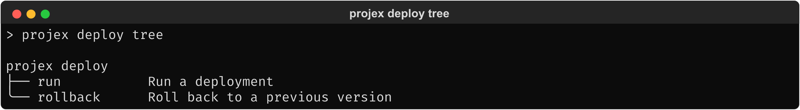
<!-- Textual output: mocks/mock_deploy_tree.txt -->

The tree root shows the full command path (`projex deploy`), so the
user can identify where the subtree sits in the hierarchy. This
uses `ctx.command_path`, the same path Click shows in `Usage:`
lines. For `show_tree()` with a synthetic context, the path
naturally contains only the group name (no parent context
available).
