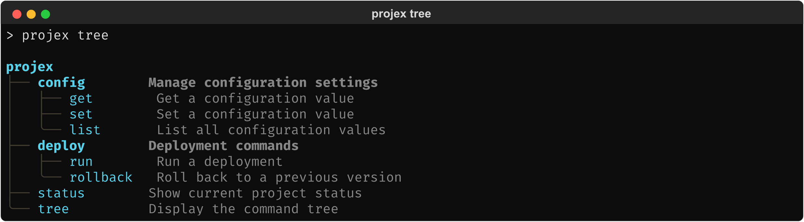
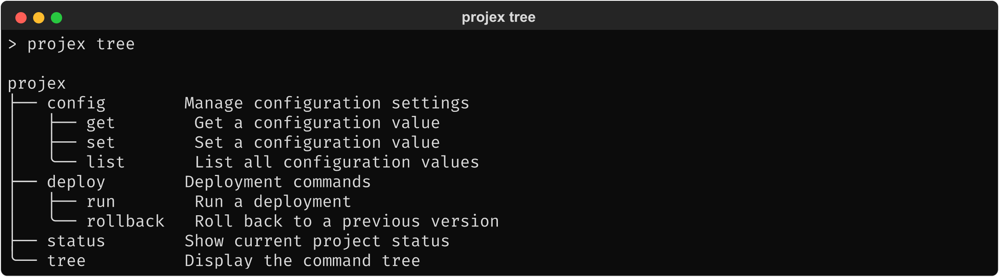
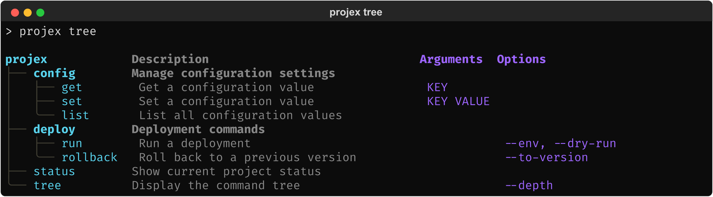
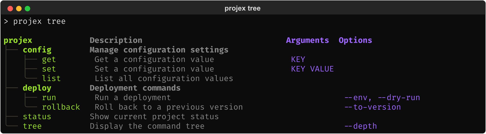

# 2.3.2. UX: Rich

What changes when `rich` is available as an optional dependency. All
scenarios build on the plain Click experience from section 2.3.1.

## 2.3.2.1. Auto-detection

When `rich` is installed, tree output gains color and styling
automatically. No code changes required — the same code from section 2.3.1
produces styled output:

```python
# Same code as section 2.3.1 — no changes for Rich support
@click.group(cls=PrismGroup)
def cli():
    """Projex — a project management tool."""
```

**End user: `projex --help` or `projex tree`** (with `rich`)


<!-- Textual output: mocks/mock_tree_rich.txt -->

The same tree structure as in section 2.3.1, with visual enhancements:

- **Bold group rows** — the entire row for groups like `config` and
  `deploy` is bold across all columns, creating visual section
  headers. Together with tree characters and the 1-char description
  indent, this compensates for the columnar layout's reduced
  indentation (section 2.3.1).
- **Cyan names** — command and group names are cyan; group names are
  additionally bold from the row style.
- **Dimmed secondary text** — help text is dimmed; on group rows
  also bold. Guide characters (│, ├, ╰, ─) are muted grey
  (`bright_black`, dimmed).
- **Terminal-aware colors** — all colors use named ANSI values (e.g.,
  `cyan`, `bright_black`) that respect the terminal's palette
  (section 2.1.2).

**End user: `projex --help` or `projex tree`** (without `rich`)


<!-- Textual output: mocks/mock_tree_plain.txt -->

Identical to the plain output from section 2.3.1. No warnings, no errors —
the output is simply unstyled Unicode text.

The developer does not need to know or care whether `rich` is installed.
The same code produces appropriate output in either case.
Auto-detection also applies to the standalone functions (`show_tree()`
and `render_tree()`): when `rich` is installed and stdout is a TTY,
they produce styled output too.

## 2.3.2.2. Graceful degradation

`rich` output adapts to the terminal environment:

| Condition | Behavior |
|---|---|
| TTY with color support | Full `rich` styling (bold, dim, colors) |
| Piped output (`projex tree \| cat`) | Plain text, no ANSI codes |
| `NO_COLOR` set | Colors stripped, bold/dim/italic preserved (`rich`'s Console handles this) |
| Limited color terminal | Reduced palette, `rich` selects closest matches |
| Narrow terminal | Tree wraps or truncates gracefully |

This follows `rich`'s own detection logic (section 2.1.2) — `click-prism` does
not implement its own terminal detection.

## 2.3.2.3. Theming

The developer can customize the visual styling applied when `rich` is
present. The theming model has two orthogonal axes:

- **Vertical (per-column):** color and dim for each column — guides,
  group names, command names, description, arguments, options.
- **Horizontal (per-row-type):** bold, italic, and dim for each row
  type — title row, group rows, command rows.

A cell's final style is the composition of its column style and its
row style. For dim (the one modifier that can appear on both axes),
the merge is OR — if either axis sets dim, it applies.

Color is a vertical concern only. The horizontal axis controls text
weight and emphasis, never color. This keeps the axes independent:
changing a column color never affects row emphasis, and vice versa.

### 2.3.2.3.1. Vertical axis — per-column styling

| Column | Modifiers | Description |
|---|---|---|
| Guides | color, dim | Tree drawing characters (│, ├, ╰, ─) |
| Group names | color, dim | Names of groups |
| Command names | color, dim | Names of leaf commands |
| Description | color, dim | Help text column |
| Arguments | color, dim | Arguments column (when `show_params` is enabled) |
| Options | color, dim | Options column (when `show_params` is enabled) |

Group names and command names are separate vertical entries so the
developer can assign different colors when targeting terminals that
do not support bold — where the horizontal axis alone would not be
enough to distinguish groups from leaf commands. The default theme
sets both to the same color, relying on bold from the horizontal
axis.

Colors use `rich`'s color syntax. Named ANSI colors (e.g., `"cyan"`,
`"bright_black"`) respect the terminal's palette. Hex values (e.g.,
`"#70c0a0"`) specify exact colors.

### 2.3.2.3.2. Horizontal axis — per-row-type styling

| Row type | Modifiers | Description |
|---|---|---|
| Title row | bold, italic, dim | Column headers (including root command name) |
| Group rows | bold, italic, dim | Rows representing groups |
| Command rows | bold, italic, dim | Rows representing leaf commands |

### 2.3.2.3.3. Default theme

The built-in default uses named ANSI colors:

**Vertical:**

| | Guides | Group names | Command names | Description | Arguments | Options |
|---|---|---|---|---|---|---|
| **Color** | `bright_black` | `cyan` | `cyan` | — | `bright_blue` | `blue` |
| **Dim** | yes | — | — | yes | — | — |

**Horizontal:**

| | Title row | Group rows | Command rows |
|---|---|---|---|
| **Bold** | yes | yes | — |
| **Italic** | — | — | — |
| **Dim** | — | — | — |

This produces the look described in section 2.3.2.1: cyan names, bold group
rows, dimmed help text and guides, blue parameter columns. All
colors adapt to the terminal's palette.

With `show_params` enabled, all six themeable columns are visible:


<!-- Textual output: mocks/mock_tree_rich_default_params.txt -->

### 2.3.2.3.4. Custom themes

```python
from click_prism import (
    PrismGroup, TreeConfig, TreeTheme,
    ThemeColumns, ThemeRows, ColumnStyle, RowStyle,
)

@click.group(cls=PrismGroup, tree_config=TreeConfig(
    theme=TreeTheme(
        columns=ThemeColumns(
            guides=ColumnStyle(color="bright_black", dim=True),
            group_names=ColumnStyle(color="green"),
            command_names=ColumnStyle(color="bright_green"),
            description=ColumnStyle(dim=True),
            # arguments/options: not overridden — default theme
            # applies (bright_blue / blue)
        ),
        rows=ThemeRows(
            title=RowStyle(bold=True),
            groups=RowStyle(bold=True, italic=True),
        ),
    )
))
def cli():
    """Projex — a project management tool."""
```


<!-- Textual output: mocks/mock_tree_rich_themed.txt -->

Exact class and field names may evolve during design. The structural
principles are the requirement: the API separates column styling
from row styling, and each axis exposes only the modifiers it owns
(`ColumnStyle`: color, dim; `RowStyle`: bold, italic, dim) — the
type system teaches what is possible on each axis and prevents
invalid combinations at definition time rather than through runtime
validation. Ease of use comes from opt-in overrides: the developer
only specifies fields where they want to deviate from the default
theme — everything else inherits automatically.

### 2.3.2.3.5. Built-in themes

`click-prism` ships with a default theme (named ANSI colors, described
above) and a catalog of additional built-in themes. Built-in themes
are selected via the `TreeTheme.built_in()` factory method:

```python
TreeConfig(theme=TreeTheme.built_in("<theme-name>"))
```

The catalog of named built-in themes — their names, color values,
and aesthetic intent — is defined during phase 8 (section 5.9). Passing an
unknown name raises `PrismError`.

### 2.3.2.3.6. Theme portability

When `rich` is not installed, theme settings are silently ignored — the
same configuration works in both environments. The developer does not
need conditional code.

## 2.3.2.4. Tree-as-help with Rich

When tree-as-help is active (section 2.3.1.4) and `rich` is installed, the
tree in `--help` output is also styled:

**End user: `projex --help`** (with `rich`)

The tree portion of the help output gains the same styling as the
tree subcommand (bold groups, dim help text, colored guides). The
rest of the help output (`Usage:`, `Options:`) follows Click's
standard formatting.

When a `rich`-aware help formatter is also in use (e.g., from
`rich-click`), `click-prism` handles help pages where tree-as-help is
active and delegates all other groups to the wrapped class. The two
renderers never share the same page — each owns its output
completely.
