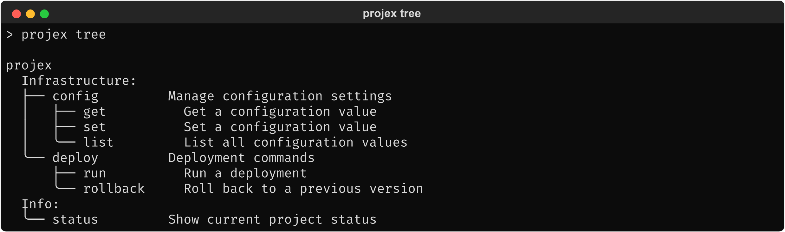
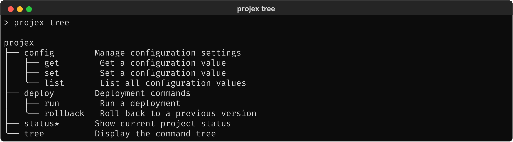
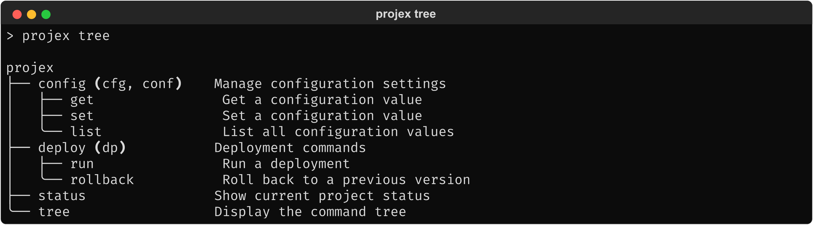

# 2.3.3. UX: Composability

How `click-prism` works alongside the Click ecosystem packages
identified as relevant neighbors in section 1.1.4. Each section shows the
desired developer experience and expected behavior when combining
`click-prism` with another package.

## 2.3.3.1. General pattern

All relevant neighbor packages (section 1.2.3) integrate via custom Group
subclasses. `click-prism` is combinable with any of them. The desired
developer experience: combining two packages is as straightforward
as using either one alone.

The examples below use a `wrapping()` pattern to express "I want
PrismGroup behavior combined with this other Group subclass." The
exact API may evolve during design; the key requirement is that the
combination is ergonomic and does not require the developer to
understand Python class internals.

For all examples: the subcommand-only path (`tree_command()`) works
as a universal fallback. It adds a tree subcommand to any group
regardless of its class, without requiring a combined Group subclass
(section 2.3.3.10). The tree subcommand is always opt-in — `PrismGroup` does
not create one automatically.

## 2.3.3.2. rich-click

`rich-click` provides `RichGroup`, which replaces Click's help
rendering with `rich`-formatted panels.

### 2.3.3.2.1. Developer code

```python
import click
from click_prism import PrismGroup
from rich_click import RichGroup

@click.group(cls=PrismGroup.wrapping(RichGroup))
def cli():
    """Projex — a project management tool."""
```

### 2.3.3.2.2. Expected behavior

- **`projex --help`** (tree-as-help on root): `PrismGroup` renders
  the page — the Commands section shows a tree with `click-prism`'s
  `rich` styling (section 2.3.2), while Usage and Options use Click's standard
  formatting. `rich-click`'s panels do not appear on the root page.
- **`projex deploy --help`** (subgroup help): `RichGroup` renders
  the page — full `rich-click` panels, styled headings, colored
  options. `click-prism` does not interfere.
- **`projex tree`**: Tree output with `rich` styling (section 2.3.2).

The delegation is automatic: `PrismGroup` handles help for groups
where tree-as-help is active (the root, by default) and delegates
to the wrapped class for all other groups. This avoids any
dependency on `rich-click`'s internal layout or panel structure —
each renderer owns its pages completely, with no shared rendering
context.

The recommended tree-as-help mode when combining with `rich-click`
is "root only" (the default). "All groups" mode would cause
`PrismGroup` to handle every group's help, effectively bypassing
`rich-click`.

## 2.3.3.3. Cloup

`cloup` organizes subcommands into labeled sections.

### 2.3.3.3.1. Developer code

```python
import click
import cloup
from cloup import Section
from click_prism import PrismGroup

INFRA_SECTION = Section("Infrastructure")
INFO_SECTION = Section("Info")

@cloup.group(cls=PrismGroup.wrapping(cloup.Group),
             sections=[INFRA_SECTION, INFO_SECTION])
def cli():
    """Projex — a project management tool."""

@cli.group(section=INFRA_SECTION)
def config():
    """Manage configuration settings."""

@cli.group(section=INFRA_SECTION)
def deploy():
    """Deployment commands."""

@cli.command(section=INFO_SECTION)
def status():
    """Show current project status."""
```

### 2.3.3.3.2. Expected behavior

- **`projex tree`**: Tree output preserves `cloup`'s section
  grouping. Each section appears as a heading with its own tree
  fragment beneath it. Sections carry semantic meaning (logical
  grouping) that the tree's structural nesting does not capture —
  dropping them would lose information the developer intentionally
  provided.
- **`projex --help`** (standard help, tree-as-help disabled):
  `cloup`'s sectioned format with `Infrastructure:` and `Info:`
  headings.
- **`projex --help`** (tree-as-help on root): The tree replaces the
  sectioned command list, with sections preserved as headings.

**End user: `projex tree`**


<!-- Textual output: mocks/mock_tree_cloup.txt -->

## 2.3.3.4. click-extra

`click-extra` builds on `cloup` and adds automatic flags like
`--color`, `--config`, etc.

### 2.3.3.4.1. Developer code

```python
from click_extra import ExtraGroup
from click_prism import PrismGroup

@click.group(cls=PrismGroup.wrapping(ExtraGroup))
def cli():
    """Projex — a project management tool."""
```

### 2.3.3.4.2. Expected behavior

Same as `cloup` (section 2.3.3.3) plus:

- `click-extra`'s injected flags (`--color`, `--no-color`, etc.)
  work as expected alongside `click-prism`.
- `click-extra`'s `--show-params` (which shows a parameter table) is
  a different view from `click-prism`'s tree — both coexist without
  conflict.

## 2.3.3.5. click-help-colors

`click-help-colors` colorizes help output via ANSI codes injected at
the formatter level.

### 2.3.3.5.1. Developer code

```python
import click
from click_prism import PrismGroup
from click_help_colors import HelpColorsGroup

@click.group(
    cls=PrismGroup.wrapping(HelpColorsGroup),
    help_headers_color="yellow",
    help_options_color="green",
)
def cli():
    """Projex — a project management tool."""
```

### 2.3.3.5.2. Expected behavior

- **`projex tree`**: Tree output styled by `click-prism` (or `rich`, if
  installed). `click-help-colors` does not affect tree rendering —
  it operates on the help formatter, not on tree output.
- **`projex deploy --help`** (standard help): Colorized by
  `click-help-colors` — yellow headings, green options.
- Each package owns its domain: `click-help-colors` styles standard
  help text, `click-prism` handles tree output.

## 2.3.3.6. click-didyoumean

`click-didyoumean` adds "did you mean?" suggestions for mistyped
commands.

### 2.3.3.6.1. Developer code

```python
import click
from click_prism import PrismGroup
from click_didyoumean import DYMGroup

@click.group(cls=PrismGroup.wrapping(DYMGroup))
def cli():
    """Projex — a project management tool."""
```

### 2.3.3.6.2. Expected behavior

- **`projex tree`**: Normal tree output.
- **`projex statu`** (mistyped): "Did you mean 'status'?" suggestion
  from `click-didyoumean`. `click-prism` does not interfere with
  command resolution.
- Both features are purely additive — tree visualization and typo
  suggestions are independent UX enhancements that do not conflict.

No mock needed — the expected behavior is standard
`click-didyoumean` output, unmodified by `click-prism`.

## 2.3.3.7. click-default-group

`click-default-group` sets a default subcommand that runs when no
subcommand is specified.

### 2.3.3.7.1. Developer code

```python
import click
from click_prism import PrismGroup
from click_default_group import DefaultGroup

@click.group(cls=PrismGroup.wrapping(DefaultGroup),
             default="status", default_if_no_args=True)
def cli():
    """Projex — a project management tool."""
```

### 2.3.3.7.2. Expected behavior

- **`projex`** (no arguments): Runs the `status` command (the
  default).
- **`projex tree`**: Tree output with the default command visually
  indicated, matching how `click-default-group` marks it in standard
  help (section 1.2.3):


<!-- Textual output: mocks/mock_tree_default_group.txt -->

The `*` marker (or equivalent) preserves the information that
`click-default-group` communicates in its flat help output.

## 2.3.3.8. click-aliases

`click-aliases` adds command aliases.

### 2.3.3.8.1. Developer code

```python
import click
from click_prism import PrismGroup
from click_aliases import ClickAliasedGroup

@click.group(cls=PrismGroup.wrapping(ClickAliasedGroup))
def cli():
    """Projex — a project management tool."""

@cli.group(aliases=["cfg", "conf"])
def config():
    """Manage configuration settings."""

@cli.group(aliases=["dp"])
def deploy():
    """Deployment commands."""
```

### 2.3.3.8.2. Expected behavior

Tree output shows aliases alongside the canonical command name,
matching `click-aliases`' own help format (section 1.2.3):


<!-- Textual output: mocks/mock_tree_aliases.txt -->

## 2.3.3.9. Multi-plugin stacking

A real-world CLI might use several packages together:

```python
from click_prism import PrismMixin
from rich_click import RichGroup
from click_didyoumean import DYMGroup

class MyGroup(PrismMixin, DYMGroup, RichGroup):
    pass

MyGroup.group_class = MyGroup

@click.group(cls=MyGroup)
def cli():
    """Projex — a project management tool."""
```

This works because `PrismMixin` uses cooperative `super()` and most
Click Group subclasses inherit directly from `click.Group`. The
developer must place `PrismMixin` first in the MRO so it controls
`format_help()`.

An ergonomic API for multi-plugin stacking (avoiding manual
subclassing and MRO knowledge) is out of scope for the initial
release. `wrapping()` covers the common case of combining
click-prism with a single other package. Manual subclassing is the
documented workaround for 3+ classes — it is possible, but not
yet convenient.

## 2.3.3.10. Subcommand-only path with plugins

The subcommand-only path (section 2.3.1) works with any group, regardless
of its class:

```python
from rich_click import RichGroup
from click_prism import tree_command

@click.group(cls=RichGroup)
def cli():
    """Projex — a project management tool."""

# ... commands ...

cli.add_command(tree_command())
```

`tree_command()` adds the tree subcommand without requiring the
group to use `PrismGroup` or a combined class. This is a fallback for
cases where:

- The wrapping approach is not feasible for a particular package
  combination
- The developer doesn't want tree-as-help, only the tree subcommand
- The group class is set deep in framework code that the developer
  doesn't control
